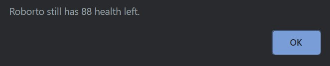

# robot-gladiators

## Description:

Robot Gladiators is a simple turn based, alert-text game where a user creates a robot to fight against a series of opponents. During a users turn, they have the option to fight, run, or choose from a series of potions. The game ends when all enemies are defeated, or the user is defeated. 

## Application Screenshot

### Round One

### Beginning of round choices

### Player Health After Fight

# Table of Contents 

- [License](#license)
- [Contributions](#contributions)
- [Technologies Used](#languages)
- [Questions](#questions)

## License:
For more information about licenses, please visit:
[License](https://opensource.org/licenses/MIT)

## Contributing:

Seth Uschuk

## Technologies Used

* HTML
* JavaScript

## Questions:

If you have any questions, please see GitHub's Guide to a Professional README, my GitHub Page, or feel free to reach out by email:

-[GitHub's Guide to a Professional README](https://github.com/coding-boot-camp/potential-enigma/blob/master/readme-guide.md)

- [My Github Profile](https://github.com/suschuk24)

- [My Email](suschuk24@gmail.com)
